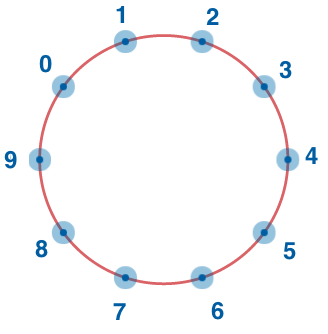

<a href="https://www.instagram.com/9_Tay"></a>

**Consider integer numbers from 0 to n - 1 written down along the circle in such a way that the distance between any two
neighboring numbers is equal (note that 0 and n - 1 are neighboring, too).**

**Given n and firstNumber, find the number which is written in the radially opposite position to firstNumber.**

### Example

For:

```
n = 10 and firstNumber = 2
```


the output should be:

```
circleOfNumbers(n, firstNumber) = 7
```

[follow me on instagram](https://www.instagram.com/9_tay)